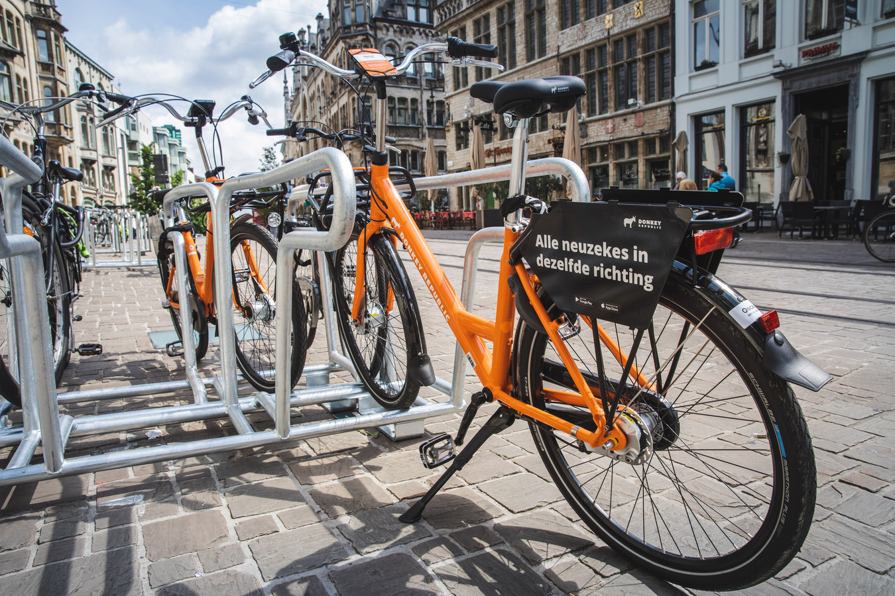

## Gegeven

Ongetwijfeld zag je reeds de oranje deelfietsen's van <a href="https://www.donkey.bike/nl/steden/fietsverhuur-gent" target="_blank">Donkey Republic</a> in de stad. Er zijn binnen Gent ongeveer 500 van deze oranje deelfietsen te vinden, die dagelijks voor ongeveer 700 ritten gebruikt worden. Voor deze deelfietsen zijn er verschillende tarieven.

- **Just Ride**

  Deze formule is op zich zeer eenvoudig. Rij met de fiets en betaal op het einde, er zijn geen verborgen lidmaatschapskosten. De kostprijs per uur kan benaderd worden met deze **formule** $$\mathsf{3,3\cdot \sqrt{t}}$$, waarbij $$\mathsf{t}$$ de tijd in uren voorstelt.
- **Lidmaatschap Daily Rider**

  Dit lidmaatschap kost ongeveer **€1 per dag**. Daarbij krijg je dagelijks **één uur gratis rijtijd**. Indien je de fiets langer gaat gebruiken, dan wordt de formule uit het **Just Ride** pakket gebruikt.

{:data-caption="Alle neuzekes in dezelfde richting." width="40%"}

## Gevraagd

Schrijf een programma dat naar de verwachtte dagelijkse fietstijd (in uren) vraagt. Daarna bereken je de goedkoopste formule.

Indien beide tarieven **even duur** zijn, kies dan voor het *Just Ride* pakket.

#### Voorbeeld
Indien een persoon dagelijks 1,5 uur fietst, dan verschijnt er:

```
Daily Rider is het meest voordelig.
Je betaalt daarmee: 3.33 euro per dag.
```

{: .callout.callout-info}
>#### Tip
> Importeer eerst de module `math` via `import math`.