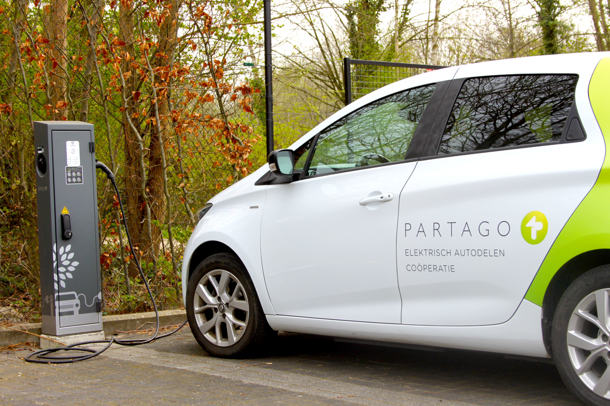

## Gegeven

Ongetwijfeld zag je reeds de deelauto's van <a href="https://www.partago.be/" target="_blank">Partago</a> in de stad. Er zijn voor deze deelauto's twee mogelijke <a href="https://www.partago.be/tarieven.html" target="_blank">formules</a>.

- **Prepaid rijbudget**
  €3,49 per uur en €0,37 per km, maar met €0 maandelijkse vaste kosten
- **Coop formule**
  €0 per uur en €0,33 per km, maar met €75 maandelijkse vaste kosten.

{:data-caption="Een elektrische deelauto van Partago." width="40%"}

## Gevraagd

Schrijf een programma dat in volgorde naar het aantal uren maandelijkse rijtijd vraagt en daarna naar het aantal maandelijkse gereden kilometers. Vervolgens bereken je de kostprijs van de twee formules. Rond de bedragen af tot een getal met twee decimalen! 

Indien beide formules even duur zijn, kies dan voor het prepaid pakket.

#### Voorbeeld
Indien een persoon in een maand nauwelijk 4,5 uur met de wagen rijdt en hierbij 307 km aflegt, dan verschijnt er:

```
Pakket  is het meest voordelig.
Je betaalt daarmee:  euro.
```

