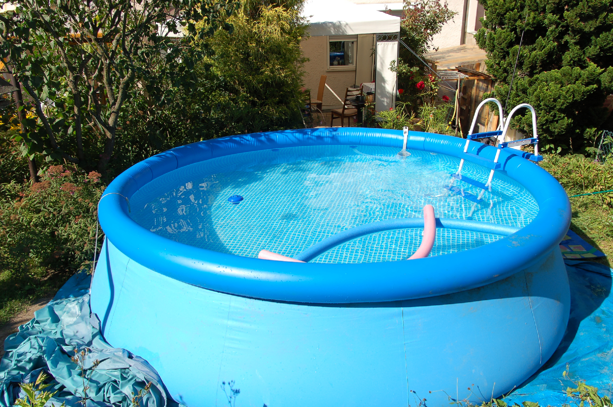

## Gegeven

Twee buren, Eddy en Freddy, in de wijk maken onophoudelijk ruzie over wie er nu het grootste zwembad heeft liggen in de tuin. In tijden van energiebesparing niet de beste beslissing... maar die ruzie is snel beslecht met een eenvoudige berekening!   

{:data-caption="Een cirkelvormig oplaasbaar zwembad." width="40%"}

## Gevraagd

* Maak een programma dat, van de twee cirkelvormige zwembaden, de `diameter` en `diepte` vraagt aan de gebruiker. 
* Bereken nadien het `volume` van beide zwembaden en toon deze op het scherm. Rond hierbij af tot twee decimalen. 
* Geef tot slot op het scherm weer welke van de twee buren het grootste zwembad heeft. 

Vraag **eerst** naar de **diameter** en **diepte** van het zwembad van Eddy (in m), nadien vraag je dit in **dezelfde volgorde** van Freddy.

#### Voorbeeld

Indien het zwembad van Eddy een diameter van 5,3 m en een diepte van 1.3 m heeft en het zwembad van Freddy 5,9 m als diameter en een diepte van 1,1 m heeft, dan verschijnt er:

```
Freddy heeft het grootste zwembad van de buurt.
Het zwembad heeft een volume van  30.07 m³.
```

{: .callout.callout-info}
>#### Tip
> Gebruik de constante `math.pi` nadat je `math` importeerde.
