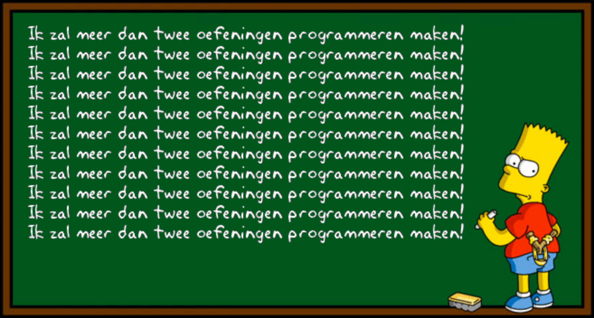

## Gegeven

Bartholomew Jojo (Bart) Simpson is een personage uit de animatieserie The Simpsons. Matt Groening bedacht <a href="https://nl.wikipedia.org/wiki/Bart_Simpson" target="_blank">Bart</a> samen met de andere Simpsons als onderdeel van een animatiefilmpje die hij moest maken. De personages waren allemaal gebaseerd op Matt zijn eigen gezinsleden.

In een interview maakte Matt bekend dat hij de naam "Bart" koos omdat het een anagram is van "brat" (Engels voor "kwajongen"). In de opening sequence van een episode zie je Bart Simpson straf schrijven op een schoolbord.

{:data-caption="Bart Simpson" width="45%"}

## Gevraagd
Schrijf een programma dat een natuurlijk getal vraagt en vervolgens evenveel keer de zin `"Ik zal meer dan twee oefeningen programmeren maken!"` op het scherm afdrukt.

#### Voorbeeld
Na invoer van `11` verschijnt:
```
Ik zal meer dan twee oefeningen programmeren maken!
Ik zal meer dan twee oefeningen programmeren maken!
Ik zal meer dan twee oefeningen programmeren maken!
Ik zal meer dan twee oefeningen programmeren maken!
Ik zal meer dan twee oefeningen programmeren maken!
Ik zal meer dan twee oefeningen programmeren maken!
Ik zal meer dan twee oefeningen programmeren maken!
Ik zal meer dan twee oefeningen programmeren maken!
Ik zal meer dan twee oefeningen programmeren maken!
Ik zal meer dan twee oefeningen programmeren maken!
Ik zal meer dan twee oefeningen programmeren maken!
```