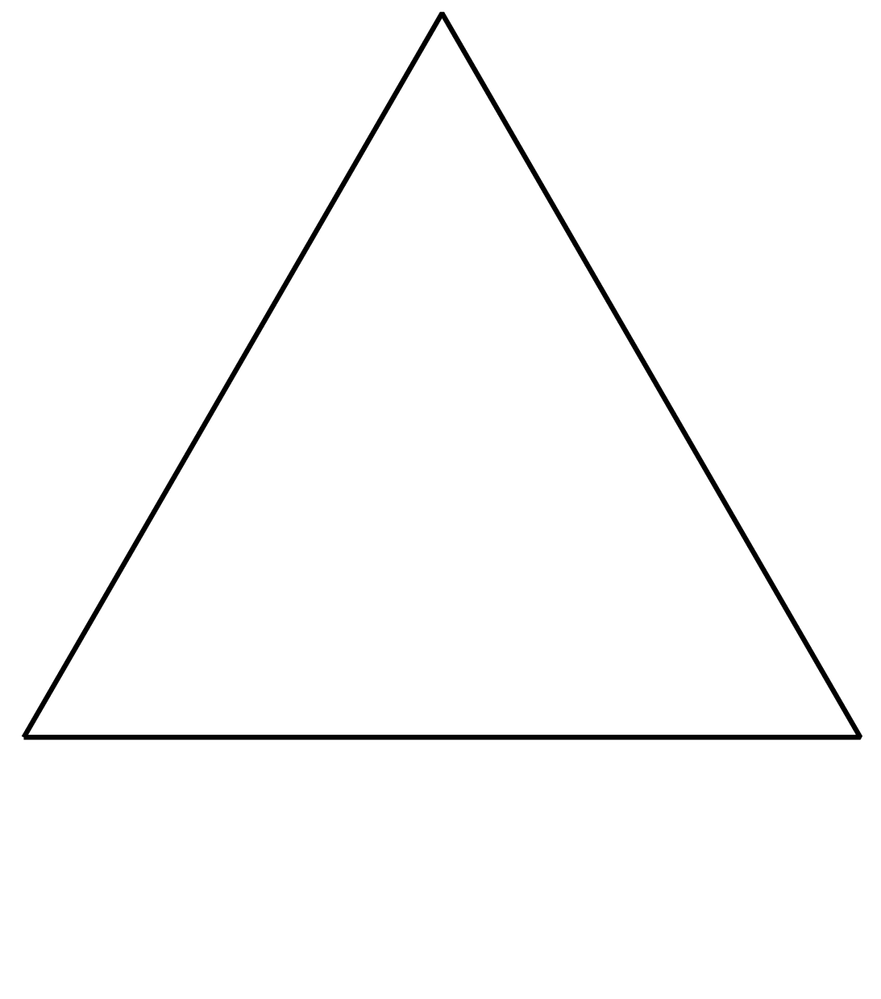

## Gegeven
De sneeuwvlok van Koch is een <a href="https://nl.wikipedia.org/wiki/Fractal" target="_blank">fractaal</a> die gevormd wordt door elke zijde van een gelijkzijdige driehoek in drie delen te verdelen en nadien op het middelste deel opnieuw een gelijkzijdige driehoek te tekenen. Dit proces oneindig lang uitvoeren resulteert in een figuur die er als een sneeuwvlok uitziet.

Het was wiskundige <a href="https://nl.wikipedia.org/wiki/Helge_von_Koch" target="_blank">Helge von Koch</a> die zijn naam gaf aan deze fractaal.

{:data-caption="Vorming van Koch's sneeuwvlok." .light-only width="30%"}

{:data-caption="Vorming van Koch's sneeuwvlok." .dark-only width="30%"}

De sneeuwvlak van Koch heeft een oneindig grote omtrek, maar indien de zijde van de oorspronkelijke gelijkzijdige driehoek $$\mathsf{z}$$ noemt, dan kan je de omtrek $$\mathsf{P}$$ bij iteratie $$\mathsf{n}$$ berekenen via:

$$
    \mathsf{A = 3 \cdot z \cdot \left(\dfrac{4}{3} \right)^n}
$$


## Gevraagd
Schrijf een programma dat de zijde van de oorspronkelijke driehoek (in cm) vraag en nadien het nummer in de iteratie. Vervolgens worden de verschillende omtrekken op het scherm weergegeven. Telkens **afgerond** op 2 cijfers na de komma.

#### Voorbeeld
Meet de zijde `2` cm en bereken je de omtrek tot en met iteratie `5`, dan verschijnt er:
```
De startomtrek was 6.0 cm.
In iteratie 1 bedraagt de omtrek 8.0 cm.
In iteratie 2 bedraagt de omtrek 10.67 cm.
In iteratie 3 bedraagt de omtrek 14.22 cm.
In iteratie 4 bedraagt de omtrek 18.96 cm.
In iteratie 5 bedraagt de omtrek 25.28 cm.
```
