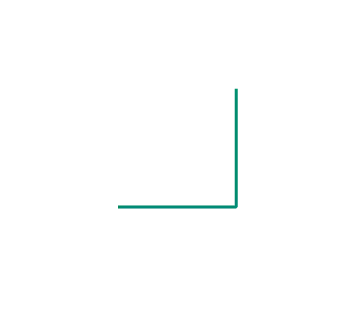

## Gegeven

De <a href="https://en.wikipedia.org/wiki/Dragon_curve" target="_blank">draakkromme</a> is een zeer interessante <a href="https://nl.wikipedia.org/wiki/Fractal" target = "_blank">fractaal</a> gevonden door de fysici John Heighway, Bruce Banks en William Harter terwijl ze werkten voor de NASA. De kromme speelt ook een belangrijke rol in het boek <a href="https://nl.wikipedia.org/wiki/Jurassic_Park_(boek)" target="_blank">Jurassic Park</a> van Michael Crichton.

De draakkromme ontstaat door elk lijnstuk op een specifieke manier in **twee te verdelen**. De lengtes van de lijnstukken worden telkens kleiner gemaakt door deze te **delen** door $$\mathsf{\sqrt{2}}$$.

{:data-caption="Vorming van de draakkromme." .light-only width="354px"}

{:data-caption="Vorming van de draakkromme." .dark-only width="354px"}

## Gevraagd
Schrijf een programma dat de lengte van één zijde vraagt en **nadien** het nummer in de iteratie. Vervolgens worden de verschillende lengtes op het scherm weergegeven. Telkens **afgerond** op 2 cijfers na de komma.

#### Voorbeeld
Meet de zijde oorspronkelijk `1` cm en bereken je de lengte tot en met iteratie `5`, dan verschijnt er:
```
De startlengte was 2.0 cm.
In iteratie 1 bedraagt de lengte van de draakkromme 2.83 cm.
In iteratie 2 bedraagt de lengte van de draakkromme 4.0 cm.
In iteratie 3 bedraagt de lengte van de draakkromme 5.66 cm.
In iteratie 4 bedraagt de lengte van de draakkromme 8.0 cm.
In iteratie 5 bedraagt de lengte van de draakkromme 11.31 cm.
```
