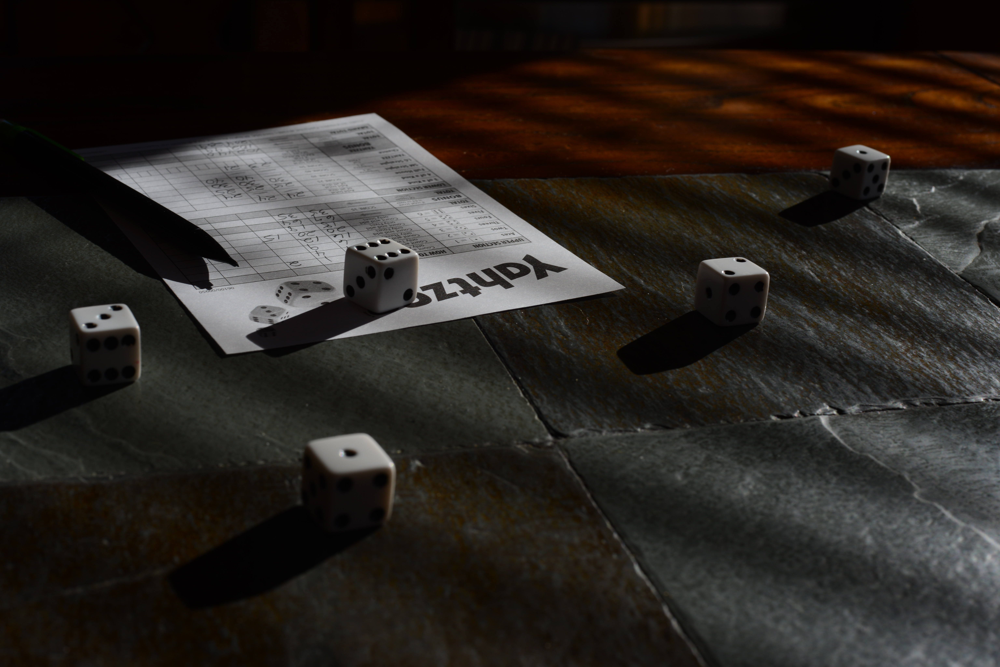

<a href="https://nl.wikipedia.org/wiki/Yahtzee" target="_blank">Yahtzee</a> (uitgesproken als jɑtse) is een dobbelspel dat wat gelijkenissen heeft met poker. Het wordt gespeeld met vijf dobbelstenen en een notitieblok. Elke speler rolt de dobbelstenen op zijn beurt en scoort punten met bepaalde combinaties.

Indien **alle** dobbelstenen hetzelfde aantal ogen hebben, dan noemt de combinatie Yahtzee en levert die de meeste punten (namelijk 50) op.

{:data-caption="Yahtzee, foto door Kent Landerholm op FLickr." width="35%"}

Hoewel je in het spel drie keer opnieuw mag werpen blijft de kans op de Yahtzee worp is natuurlijk vrij klein. Maar wat is de kans op één van de andere combinaties, bijvoorbeeld de *grote straat*? Een grote straat betekent dat je **vijf opeenvolgende dobbelstenen** hebt. Onderstaande worp is een voorbeeld van een grote straat, deze levert 40 punten op.

 <span class="mdi mdi-36px mdi-dice-5-outline"></span> <span class="mdi mdi-36px mdi-dice-2-outline"></span> <span class="mdi mdi-36px mdi-dice-1-outline"></span> <span class="mdi mdi-36px mdi-dice-4-outline"></span> <span class="mdi mdi-36px mdi-dice-3-outline"></span>

## Gevraagd
Om deze kans te achterhalen **simuleren** we een groot aantal worpen en kijken we hoevaak een *grote straat* voorkomt. Vraag aan de gebruiker hoeveel worpen die wenst te simuleren. In elke worp gebruik je de functie `random.randint(a, b)` om de dobbelstenen te simuleren.

#### Voorbeelden
Bij `100` worpen verschijnt bijvoorbeeld:

```
De kans op grote straat is ongeveer 4.0 %
```

Bij `10000` worpen verschijnt bijvoorbeeld:

```
De kans op grote straat is ongeveer 3.13 %
```


{: .callout.callout-info}
>#### Tips
>* Welke 5 cijfers leiden tot een grote straat? Indien het minimum 1 is en het maximum 6, kan je dan een grote straat hebben?
>* Bij een grote straat zijn geen enkele twee worpen aan elkaar gelijk.
>* Je moet **geen rekening** houden met het feit dat men in Yahtzee drie keer mag gooien.
