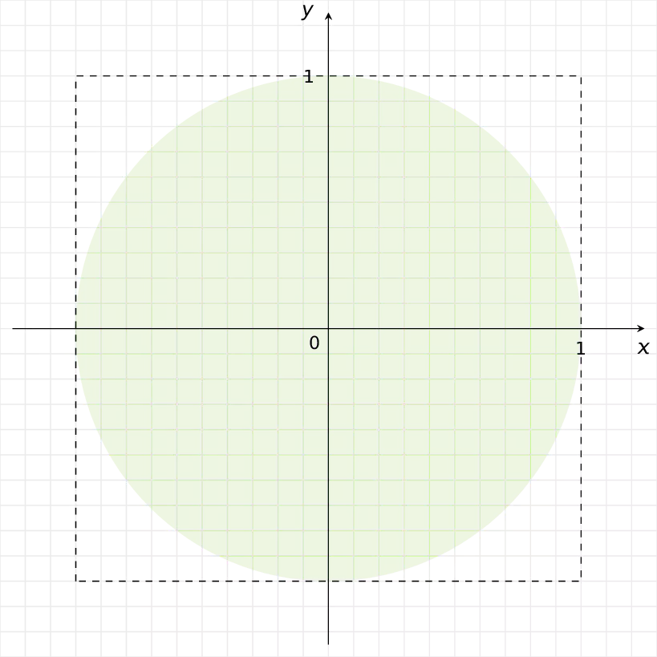
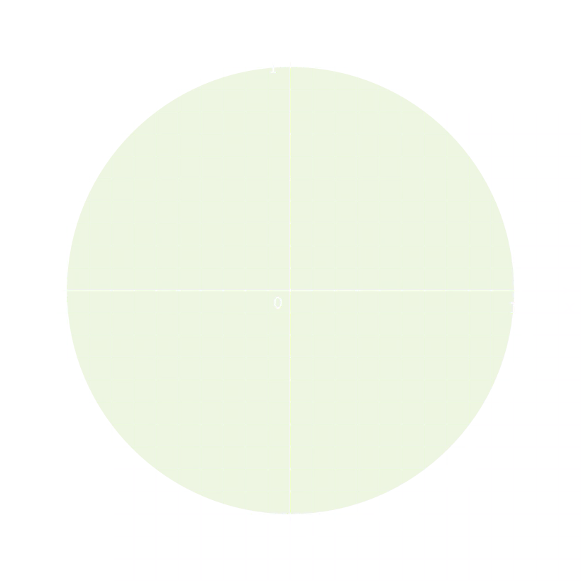

Je kan de waarde van π *schatten* door middel van simulatie. Indien men en cirkel tekent met straal 1, dan heeft deze als oppervlakte π, deze cirkel ligt binnen een vierkant met zijde 2. Het vierkant heeft dus een oppervlakte van 4.

Kies je nu willekeurig een punt met coördinaten $$\mathsf{(x,y)}$$ binnen dit vierkant, dan ligt dit ofwel binnen de cirkel, ofwel niet. Je kan dit achterhalen door de **afstand van het punt tot de oorsprong** $$\mathsf{(0,0)}$$ te berekenen via:

$$
\mathsf{\sqrt{(x-0)^2+(y-0)^2}  = \sqrt{x^2+y^2}}
$$

Indien je **bijvoorbeeld** 100 punten willekeurig kiest, dan zal hiervan ongeveer $$\mathsf{\dfrac{\pi}{4}}$$ punten binnen de cirkel liggen (quasi 78 punten). Je bekomt dus een schatting voor π door het viervoud te bepalen van de verhouding van het aantal punten binnen de cirkel tot het totale aantal gekozen punten, in dit geval zal $$\mathsf{\pi \approx 4 \cdot \dfrac{78}{100} = 3,12}$$.

{:data-caption="π simuleren." .light-only width="45%"}

{:data-caption="π simuleren." .dark-only width="45%"}

## Gevraagd
* Schrijf een programma dat vraagt hoeveel punten willekeurig gekozen moeten worden.
* Kies vervolgens zoveel verschillende x- en y-coördinaten (zie tip onderaan). 
* Controleer of het punt **binnen** de cirkel met straal 1 ligt.
* Bepaal op het einde een schatting voor π, **rond** deze **af** op 5 cijfers na de komma.

#### Voorbeeld

Bij `100000` simulaties is de uitvoer bijvoorbeeld:
```
Bij 100000 simulaties bedraagt de schatting voor pi ongeveer: 3.10748
```

{: .callout.callout-info}
>#### Tips
>* Gebruik `random.randint(-100,100) / 100` om een willekeurig kommagetal tussen -1 en 1 te verkrijgen.
>* Hou bij hoeveel punten binnenin de cirkel liggen.
>* Vergeet niet om de `random` en `math` modules eerst te importeren.
