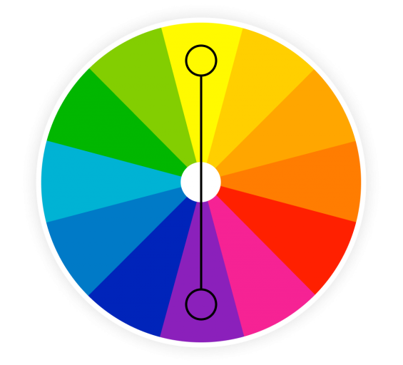

## Gegeven
Complementaire kleuren zijn kleuren die recht tegenover elkaar staan in het RGB kleurenwiel.

{:data-caption="RGB kleurenwiel." width="35%"}

Het is gemakkelijk om van een RGB kleurcode `[R, G, B]` de complementaire kleur te bepalen, men gebruikt de volgende formule:

<p style="text-align: center;"><code>[255 - R, 255 - G, 255 - B]</code></p>

## Gevraagd

Schrijf volgend programma dat voor een gegeven RGB **lijst** een nieuwe RGB **lijst** met de complementaire RGB kleurcode aanmaakt.

#### Voorbeeld
Indien de gebruiker `227 33 25` ingeeft, dan verschijnt er:

```
De complementaire kleurcode is: [28, 222, 230]
```

{: .callout.callout-info}
>#### Tip
> Je kan een lijst perfect afdrukken. Maak dus een variabele `RGB_comp = []` en sla er de verschillende getallen in op. Druk deze vervolgens af.