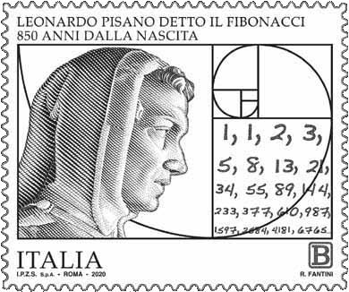

De <a href="https://nl.wikipedia.org/wiki/Rij_van_Fibonacci" target="_blank">rij van Fibonnaci</a>, genoemd naar <a href="https://nl.wikipedia.org/wiki/Fibonacci" target="_blank">Leonardo van Pisa</a>, is een opeenvolging van natuurlijke getallen die aan een bepaald patroon voldoen. Elk getal is immers de som van de vorige twee getallen, waarbij de eerst twee getallen telkens gelijk zijn aan 1. 

{:data-caption="Een Italiaanse postzegel met een tekening van Fibonnaci."}

Je kan dit wiskundig noteren met behulp van een zogenaamd **recursief** voorschrift:

$$
    \mathsf{u_n = u_{n-1} + u_{n-2}, \quad\text{waarbij}\ u_1 = 1, \text{ en } u_2 = 1}
$$

De rij begint dus als volgt:

$$
    \mathsf{1,\quad 1,\quad 2,\quad 3,\quad 5,\quad 8,\quad 13,\quad 21,\quad 34,\quad, ...}
$$

## Gevraagd
Schrijf een programma dat een rangnummer n aan de gebruiker vraagt. Daarna berekent je programma het n<sup>de</sup> getal in de rij van Fibonnaci en toont het dit op het scherm.

#### Voorbeelden

Bij invoer 3 verschijnt:
```
Het 3 e getal is 2
```

Bij invoer 9 verschijnt:
```
Het 9 e getal is 34
```