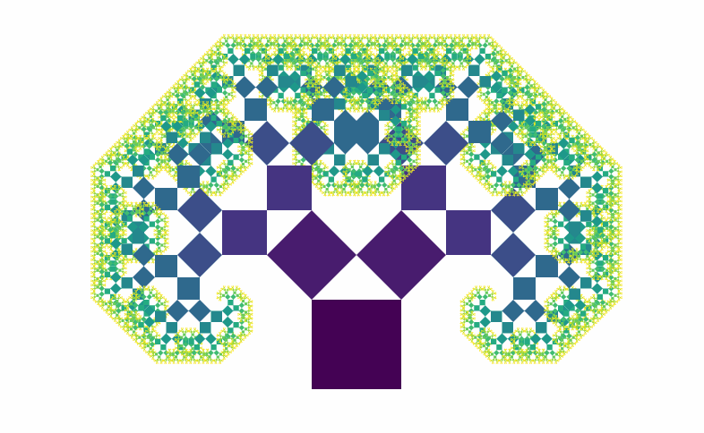

<div class="text-end">
    <a class="btn btn-filled with-icon" href="https://dodona.be/nl/courses/2419/#series-27454-hoofdstuk-3-begrensde-herhaling-for-statement" target="_blank"><i class="mdi mdi-backburger mdi-24" title="link"></i>Link naar de vorige oefeningen</a>
</div>

De <a href="https://nl.wikipedia.org/wiki/Boom_van_Pythagoras" target="_blank">boom van Pythagoras</a> is een interessante fractaal bedacht door de Nederlandse wiskundige Albert E. Bosman, tijdens zijn tewerkstelling voor de Duitsers als ingenieur. In plaats van het ontwerpen van duikbootonderdelen tekende hij deze fractaal, als vorm van stille sabotage.

{:data-caption="De boom van Pythagoras." width="500px"}

De boom ontstaat door te vertrekken met één centraal vierkant en er telkens twee identieke vierkanten op te tekenen zodat deze een rechthoekige driehoek omsluiten. De zijde van de vierkanten wordt telkens gedeeld door $$\mathsf{\sqrt{2}}$$.

## Opgave
Schrijf een programma dat aan de gebruiker de zijde (*kommagetal*) van het allereerste vierkant vraagt en **nadien** het nummer in de iteratie.

Vervolgens bereken je in elke iteratie het totale aantal vierkanten en bepaal je de oppervlakte van het kleinste vierkant uit die iteratie. Telkens **afgerond** op 4 cijfers na de komma.

#### Voorbeelden
Meet de allereerste zijde `1.0` cm en wil je de berekeningen tot iteratie `4`, dan verschijnt er:

```
Het eerste vierkant heeft als oppervlakte 1.0 cm².
In iteratie 1 zijn er 3 vierkanten in het totaal en is de oppervlakte van het kleinste vierkant 0.5 cm².
In iteratie 2 zijn er 7 vierkanten in het totaal en is de oppervlakte van het kleinste vierkant 0.25 cm².
In iteratie 3 zijn er 15 vierkanten in het totaal en is de oppervlakte van het kleinste vierkant 0.125 cm².
In iteratie 4 zijn er 31 vierkanten in het totaal en is de oppervlakte van het kleinste vierkant 0.0625 cm².
```

Meet de allereerste zijde `6.25` cm en wil je de berekeningen tot iteratie `3`, dan verschijnt er:

```
Het eerste vierkant heeft als oppervlakte 39.0625 cm².
In iteratie 1 zijn er 3 vierkanten in het totaal en is de oppervlakte van het kleinste vierkant 19.5312 cm².
In iteratie 2 zijn er 7 vierkanten in het totaal en is de oppervlakte van het kleinste vierkant 9.7656 cm².
In iteratie 3 zijn er 15 vierkanten in het totaal en is de oppervlakte van het kleinste vierkant 4.8828 cm².
```
