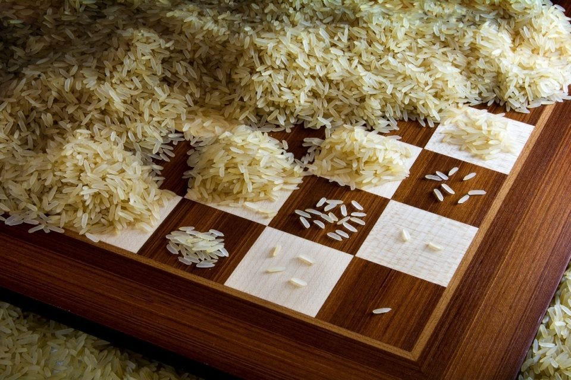

<div class="text-end">
    <a class="btn btn-filled with-icon" href="https://dodona.be/nl/courses/2419/#series-27454-hoofdstuk-3-begrensde-herhaling-for-statement" target="_blank"><i class="mdi mdi-backburger mdi-24" title="link"></i>Link naar de vorige oefeningen</a>
</div>

Volgens de legende heeft een persoon genaamd Sessa ibn Dahir uit India een voorloper van het schaakspel genaamd <a href="https://nl.wikipedia.org/wiki/Chaturanga" target="_blank">Chaturanga</a> bedacht. Uit dankbaarheid vraagt de koning hoe hij ervoor beloond wil worden. Sessa vraagt rijstkorrels te willen ontvangen, zoveel als op alle velden van het schaakbord passen. 

Hierbij geeft hij als extra regel dat er 1 rijstkorrel op het eerste veld moet liggen, daarna het dubbele op het tweede veld, daarna opnieuw het dubbele op het derde veld, enz...

{:data-caption="VHet rijstkorrelvraagstuk." width="40%"}

## Opgave
SChrijf een programma dat voor **elk veld van het schaakbord** de hoeveelheid rijstkorrels afdrukt. 

#### Voorbeeld

```
Op veld 1 ligt 1 rijstkorrel.
Op veld 2 liggen 2 rijstkorrels.
Op veld 3 liggen 4 rijstkorrels.
Op veld 4 liggen 8 rijstkorrels.
...
```

{: .callout.callout-info}
>#### Tips
> - Je moet bij deze oefening **niets** aan de gebruiker vragen.
> - Denk eraan dat een schaakbord 8 rijen en 8 kolommen heeft. 

