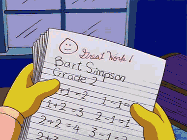

## Gegeven
De leerlingen uit een klas van vooraf **ongekende grootte** kregen hun resultaten van een toets op 20.

{:data-caption="De resultaten van Bart Simpson..." width="380px"}

## Gevraagd
* Verzamel één voor één de resultaten van de leerlingen. 
* Bij de invoer van een **strikt negatief getal** stopt het inlezen.
* Geef nadien het **aantal leerlingen** weer en het **klasgemiddelde op 20**.
* Rond het gemiddelde af tot één decimaal. 

#### Voorbeeld

Indien de gebruiker achtereenvolgend ingeeft: `14.5`, `13`, `9`, `8.5`, `15.5`, `18`, `19`, `11.5`, `12`, `13.5`, `14.5` en tot slot `-1`, dan verschijnt er:

```
Aantal leerlingen: 11
Klasgemiddelde op 20: 13.5
```

