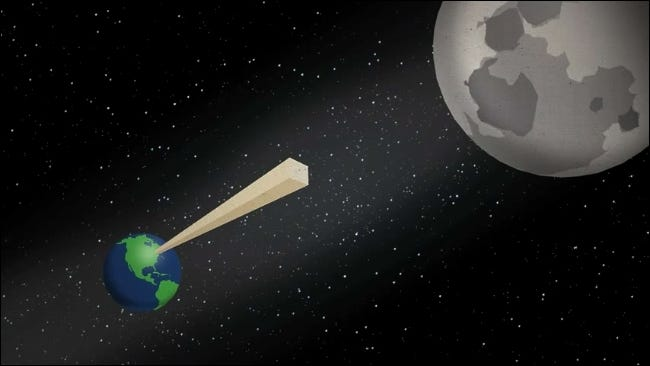

## Gegeven
Volgens <a href="https://bigthink.com/starts-with-a-bang/fold-paper-reach-moon/" target="_blank">dit artikel</a> volstaat het om een standaard A4 blad 42 keer dubbel te vouwen, om een afstand van de aarde tot te maan te overbruggen.

{:data-caption="Van de aarde tot de maan, slechts 42 keer vouwen!" width="60%"}

Onderaan zie je een programma dat eerst de dikte van 1 blad papier vraagt en dit vervolgens 42 keer dubbelvouwt. Elke dikte wordt telkens op het scherm weergeven. Indien men start met een dikte van `0.01` cm dan verschijnt na 42 keer vouwen:

```
...
Na 41 vouwen bedraagt de dikte 21990232555.52 cm.
Na 42 vouwen bedraagt de dikte 43980465111.04 cm.
Uiteindelijk werd een dikte van 439804.651 km bereikt.
```

Aangezien de afstand van de aarde tot de maan bij benadering 384 400 km is, merken we dat dit inderdaad juist is!

## Gevraagd

Hoeveel keer moet je vouwen om tot de planeet Mars te geraken? De afstand van de aarde tot Mars bedraagt gemiddeld ongeveer 225 miljoen kilometer. Of tot een andere planeet? 

Pas het programma aan, zodat eerst de **dikte** van het blad papier gevraagd wordt (in cm), daarna de **afstand** die **minimaal** bereikt moet worden (in km). Toon uiteindelijk het aantal keer dat er gevouwen moeten worden.

#### Voorbeeld

Bij een dikte van `0.01` cm en een afstand van `384400` km verschijnt:

```
Na 1 vouw bedraagt de dikte 0.02 cm.
Na 2 vouwen bedraagt de dikte 0.04 cm.
Na 3 vouwen bedraagt de dikte 0.08 cm.
...
Na 40 vouwen bedraagt de dikte 10995116277.76 cm.
Na 41 vouwen bedraagt de dikte 21990232555.52 cm.
Na 42 vouwen bedraagt de dikte 43980465111.04 cm.
Het blad moest 42 keer gevouwen worden.
```