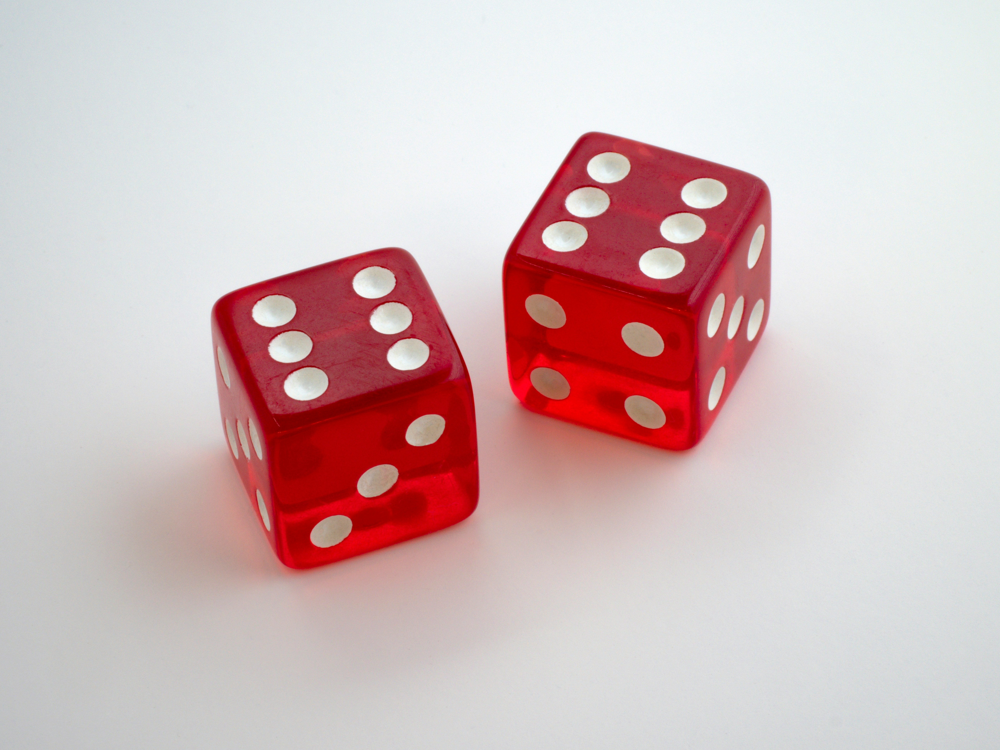

## Opgave

Schrijf een programma dat het volgende dobbelspel simuleert.

- Speler 1 krijgt twee dobbelstenen, gooit ze tegelijkertijd, telkens opnieuw tot deze twee keer een 6 gooit;
- Speler 2 doet nadien hetzelfde;
- De speler die in het minst aantal beurten twee keer een 6 kon gooien, wint. Bij evenveel beurten is het gelijkspel.

{:data-caption="Foto door Brett Jordan op Unsplash." width="35%"}

#### Voorbeeld

Indien speler 1 na vijf keer gooien reeds twee 6'en had en speler 2 er acht beurten over deed, dan verschijnt er:

```
Speler 1 wint!
```

{: .callout.callout-info}
>#### Tip
> Gebruik de `random.randint()`-functie om een willekeurige worp te simuleren tussen 1 en 6.