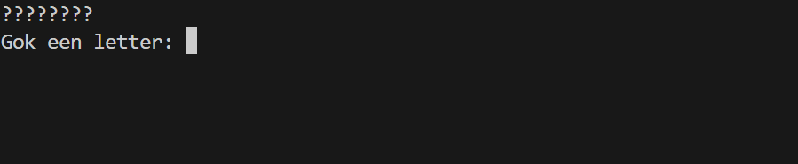

<a href="https://nl.wikipedia.org/wiki/Galgje" target="_blank">Galgje</a> is een spelletje waarbij een woord geraden moet worden, door individuele letters te raden. De spelers mogen maar een beperkt aantal fouten maken, de fouten worden vaak weergeven door een hangend mannetje aan een galg te tekenen.

{:data-caption="Galgje" .light-only width="45%"}

{:data-caption="Galgje" .dark-only width="45%"}

## Opgave

Programmeer dit spelletje. Bestudeer grondig onderstaande voorbeeld om de verschillende stappen te implementeren. Je mag ervan uitgaan dat de woorden die genomen worden telkens uit **acht tekens** bestaan.

Enkele **tips**:

- Het stukje code dat klaar staat haalt uit een lijst van quasi 200 woorden een willekeurig woord op.
- Je kan gemakkelijk itereren over een stukje tekst via:

  ```python
for i in range(8):
    letter = woord[i]
  ```

- Om de vraagtekens te vervangen door het gokje `gok` (indien dit correct is) kan je de volgende code gebruiken:

  ```python
tijdelijk = list(tekens)
tijdelijk[i] = gok           # vervangt het ? op plaats i door de gok
tekens = "".join(tijdelijk)  # slaat dit opnieuw op in de variabele tekens
  ```


#### Voorbeeld

{:data-caption="Een implementatie van galgje." width="600px"}