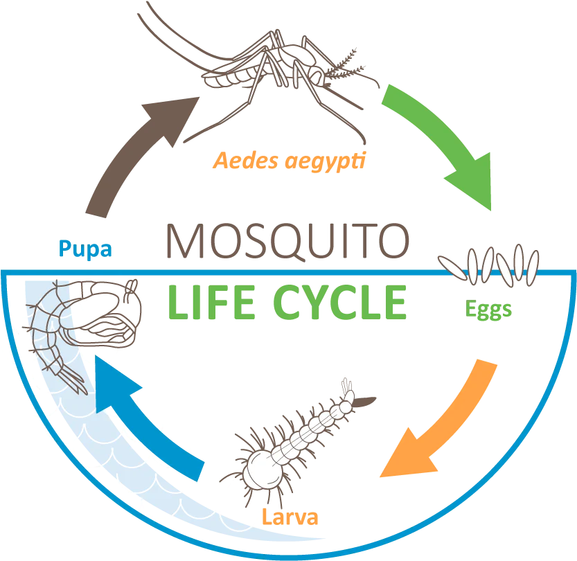

## Gegeven

Heb je je al afgevraagd waarom er zoveel muggen zijn in vochtige omgevingen? Een van de redenen is dat vrouwelijke muggen wel honderden eitjes kunnen leggen. De meeste overleven gelukkig niet, maar men zegt dat één paar muggen in enkele weken duizenden muggen kan voortbrengen.

We bekijken dit in meer detail. De levenscyclus van een mug bestaat uit 4 stadia: eitje, larve, verpopping en volwassen mug.

{:data-caption="Levenscyclus van een mug." width="35%"}

We maken nu verschillende veronderstellingen die niet volledig juist zijn in de natuur, maar om dit gemakkelijker te kunnen simuleren. We zullen ervan uitgaan dat de volgende transformaties telkens op het einde van de week plaatsvinden:

- Elke volwassen mug legt een **aantal eitjes** en sterft. Diezelfde dag wordt uit elk eitje een larve geboren,
- Sommige larven zijn niet sterk genoeg of worden opgegeten. Enkel **elke 3<sup>e</sup> larve** blijft leven en zal gaan verpoppen,
- Uit **elke 2<sup>e</sup> ontpopping** komt een mug, de andere poppen drogen uit.

Bijvoorbeeld, als er 5 larven zijn, en elke 3<sup>e</sup> overleeft, dan zal er maar 1 enkele larve gaan verpoppen. Waren er 6 larven, dan zouden er 2 verpoppen. Werk analoog voor de transformatie van poppen naar muggen.

## Gevraagd

Schijf een programma dat:

- Aan de gebruiker, in deze volgorde, het aantal muggen, het aantal larven en het aantal poppen vraagt,
- Daarna vraagt hoeveel eitjes één volwassen mug legt,
- Tot slot het aantal weken dat je wil simuleren vraagt.

Bereken hierna hoeveel muggen er zijn op het einde en geeft dit weer.

#### Voorbeelden

Stel dat er `10` muggen, `40` larven en `20` poppen zijn in het begin. Vervolgens wordt ingetikt dat één mug telkens `8` eitjes legt en er in het totaal `10` dagen gesimuleerd worden.

Er verschijnt:
```
Er zijn 22 muggen na week 10
```

Bij achtereenvolgende invoer `10`, `10`, `10` (muggen, larven en poppen) en daarna `2` (het aantal eitjes dat elke mug legt) en `6` (het aantal weken) verschijnt er:

```
Er is 1 mug na week 6
```

{: .callout.callout-secondary}
>#### Bron
> CTU Open 2012, Tsjechië