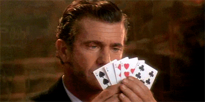

<a href="https://nl.wikipedia.org/wiki/Blackjack" target="_blank">Blackjack</a> is een spelletje dat je vaak terug vind in een casino. Het doel is om zo dicht mogelijk bij 21 punten te raken met jouw kaarten, zonder hierover te gaan.

{:data-caption="Blackjack, speel het juist!" width="300px"}

## Opgave

Programmeer dit spelletje. Als je het spel nog niet kent zorg dan dat je **grondig** opzoekt hoe het spel werkt. Je mag ervan uitgaan de computer volgende scores haalt met deze kanswaarden:

| Waarde van de computer | Kans op deze waarde |
|:------:|:------:|
|   16   |  10 %  |
|   17   |  15 %  |
|   18   |  20 %  |
|   19   |  20 %  |
|   20   |  15 %  |
|   21   |  10 %  |
|  Bust  |  10 %  |
{:class="table table-striped table-condensed" style="width:auto;margin-left:auto;margin-right:auto;"}

Enkele **tips**:

- Een aas kan een waarde van 1 **of** 11 aannemen, afhankelijk van wat de speler kiest.
- Als je een gelijke waarde haalt aan de computer, dan wint de computer nog steeds.
- Met een Bust verlies je sowieso (zowel als computer als als speler).
- Als inputs kan de gebruiker "hit" invullen om nog een kaart te krijgen of "stand" om te stoppen met spelen.
- Pas na de "stand" input krijgt de speler te zien hoeveel de computer behaalt.