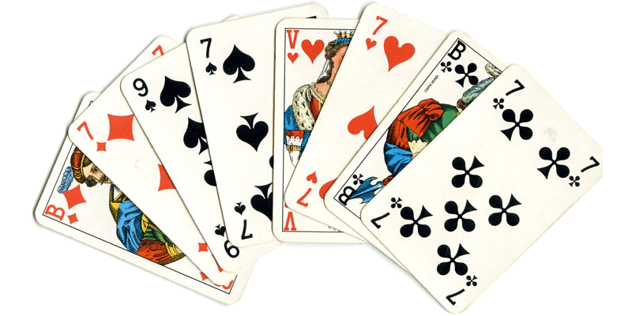

Een populair Nederlands kaartspel is *Klaverjassen*, waarin 8 kaarten worden uitgedeeld zoals in onderstaande figuur.

{:data-caption="Een gedeelde hand in Klaverjassen." width="40%"}

Deze gedeelde hand bevat de vier soorten kaarten, van links naar rechts: ruiten (♦️ in de invoer) boer en zeven, schoppen (♠️) negen en zeven, harten
(♥️) dame en zeven, en klaveren (♣️) boer en zeven. Elke kaart is een aantal punten waard, afhankelijk van de *troef*, zoals aangegeven in deze tabel:

| Kaart | Symbool | Troef punt | Niet-troef punt |
|-------|:-------:|:----------:|:---------------:|
| Boer  | B       | 20         | 2               |
| Negen | 9       | 14         | 0               |
| Aas   | A       | 11         | 11              |
| Tien  | T       | 10         | 10              |
| Heer  | H       | 4          | 4               |
| Dame  | D       | 3          | 3               |
| Acht  | 8       | 0          | 0               |
| Zeven | 7       | 0          | 0               |
{:class="table table-striped table-condensed" style="width:auto;margin-left:auto;margin-right:auto;"}

Bereken de waarde van mijn hand, gegeven een bepaalde troef, uitgedrukt in punten. Indien **schoppen** (♠️) troef is heeft de figuur 14 troefpunten (14 voor ♠️9) en 7 gewone punten (2 voor ♦️B, 3 voor ♥️D, 2 voor ♣️B). De waarde is dan dus 21. In het geval van **harten** (♥️) troef is de waarde slechts 7.


## Opgave

Schrijf een functie `klaverjassen(troef, kaarten)` die gegeven de troef en een lijst met de kaarten in een hand de waarde van de hand bepaalt.

Bestudeer grondig onderstaande voorbeelden.

#### Voorbeelden

```python
>>> klaverjassen("♠️", ["♦️B", "♦️7", "♠️9", "♠️7", "♥️D", "♥️7", "♣️B", "♣️7"])
21
```


```python
>>> klaverjassen("♥️", ["♦️B", "♦️7", "♠️9", "♠️7", "♥️D", "♥️7", "♣️B", "♣️7"])
7
```

{: .callout.callout-secondary}
>#### Bron
> Geïnspireerd op een oefening uit de Vlaamse programmeerwedstrijd 2021 - categorie 1.