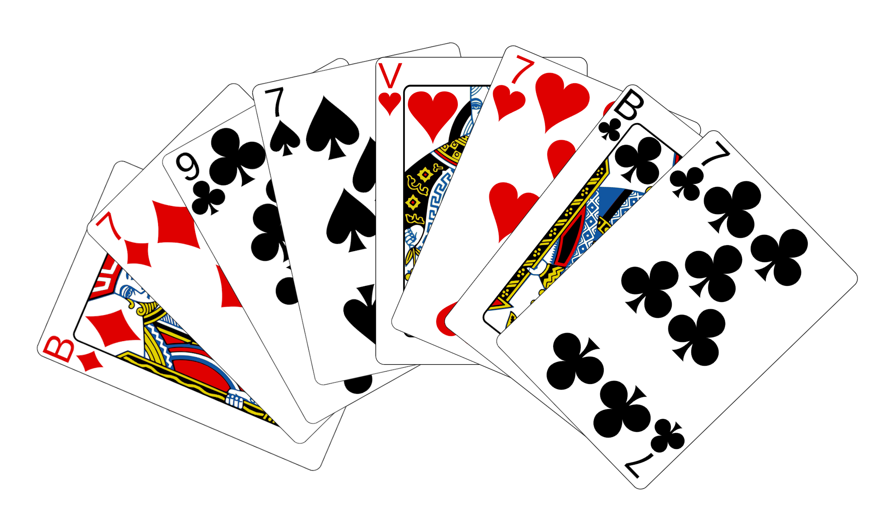

Wanneer de juryleden niet druk bezig zijn met het verzinnen van ingewikkelde algoritmes, wordt er wel eens een kaartspel gespeeld. Een populair Nederlands kaartspel is *Klaverjassen*, waarin 8 kaarten worden uitgedeeld zoals in onderstaande figuur.

{:data-caption="Een gedeelde hand in Klaverjassen." width="40%"}

Deze gedeelde hand bevat de vier soorten kaarten, van links naar rechts: ruiten (`R` in de invoer) boer en zeven, schoppen (`S`) negen en zeven, harten
(`H`) dame en zeven, en klaveren (`K`) boer en zeven. Elke kaart is een aantal punten waard, afhankelijk van de *troef*, zoals aangegeven in tabel 1:

| Kaart | Waarde | Troef punt | Niet-troef punt |
|-------|:------:|:----------:|:---------------:|
| Boer  | B      | 20         | 2               |
| Negen | 9      | 14         | 0               |
| Aas   | A      | 11         | 11              |
| Tien  | 10     | 10         | 10              |
| Heer  | H      | 4          | 4               |
| Dame  | D      | 3          | 3               |
| Acht  | 8      | 0          | 0               |
| Zeven | 7      | 0          | 0               |
{:class="table table-striped table-condensed" style="width:auto;margin-left:auto;margin-right:auto;"}

Bereken de waarde van mijn hand, gegeven een bepaalde troef, uitgedrukt in punten. Figuur 1 heeft 14 troefpunten (14 voor S9) en 7 gewone punten (2
voor RB, 3 voor HD, 2 voor KB), indien **schoppen** (`S`) troef is. Het antwoord is de som, 21. In het geval van **harten** (`H`) troef is het antwoord 7.


## Opgave

De eerste regel bevat het aantal testgevallen. Er zijn twee regels per testgeval:

regel één bevat de troef soort (R, S, H, of K), en regel twee de gedeelde hand van acht kaarten, uitgedrukt in soort (karakter één) en waarde (zie tabel), gescheiden door een spatie.

#### Voorbeelden
Mogelijk invoer is:
```
2
S
RB R7 S9 S7 HD H7 KB K7
H
RB R7 S9 S7 HD H7 KB K7
```

Voor elk testgeval wordt een regel verwacht waarin de totale punten staan
geschreven, voorafgegaan door het nummer van het testgeval.

```
1 21
2 7
```