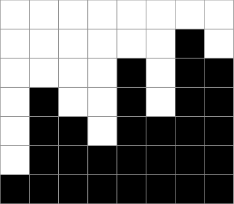
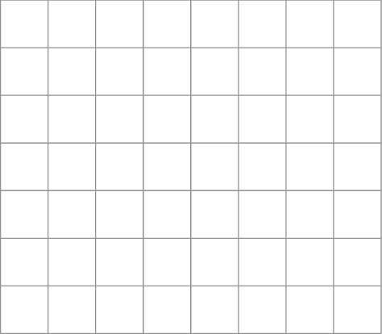
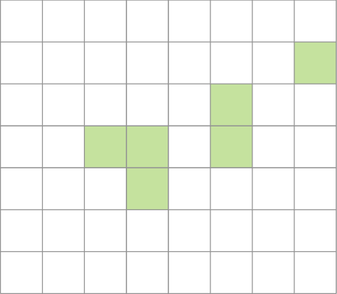

## Opgave

Je krijgt een figuur zoals hieronder: van links naar rechts gezien gaat het op en neer. Het doel is een figuur te bekomen die (ook weer van links naar rechts gezien) niet meer daalt, dus enkel stijgt of gelijk blijft. 
Gevraagd: wat is het minimaal aantal vakjes dat gekleurd moet worden om dat te bekomen?

{:data-caption="Opgave." .light-only width="30%"}

{:data-caption="Opgave." .dark-only width="30%"}

Deze figuur laat zien - met de groene vakjes - dat 6 vakjes volstaan: meer is niet nodig.

{:data-caption="Oplossing." .light-only width="30%"}

{:data-caption="Oplossing." .dark-only width="30%"}

#### Voorbeeld

De eerste regel van de invoer bevat het aantal testgevallen. Per testgeval volgt dan één regel met een aantal natuurlijke getallen, van elkaar gescheiden door één enkele spatie. Het eerste getal op elke regel geeft aan hoeveel getallen er nog volgen. De volgende getallen geven de hoogte aan van de balken. De getallen overeenkomend met het voorbeeld hiervoor zijn

$$ \mathsf{8 \quad 1 \quad 4 \quad 3 \quad 2 \quad 5 \quad 3 \quad 6 \quad 5} $$

omdat er 8 balken zijn, waarvan de eerste hoogte 1 heeft, de tweede hoogte 4, de derde hoogte 3, enzovoort.

```
3
2 1 2
2 2 1
5 5 4 3 2 1
```

De uitvoer bestaat uit één regel per testgeval. Elke regel bestaat uit twee gehele getallen, van elkaar gescheiden door één enkele spatie. Het eerste getal is de index van het testgeval (startend bij 1) en het tweede getal is het minimum aantal blokjes dat moet worden ingekleurd zodat de figuur enkel stijgt of gelijk blijft.

```
1 0
2 1
3 10
```